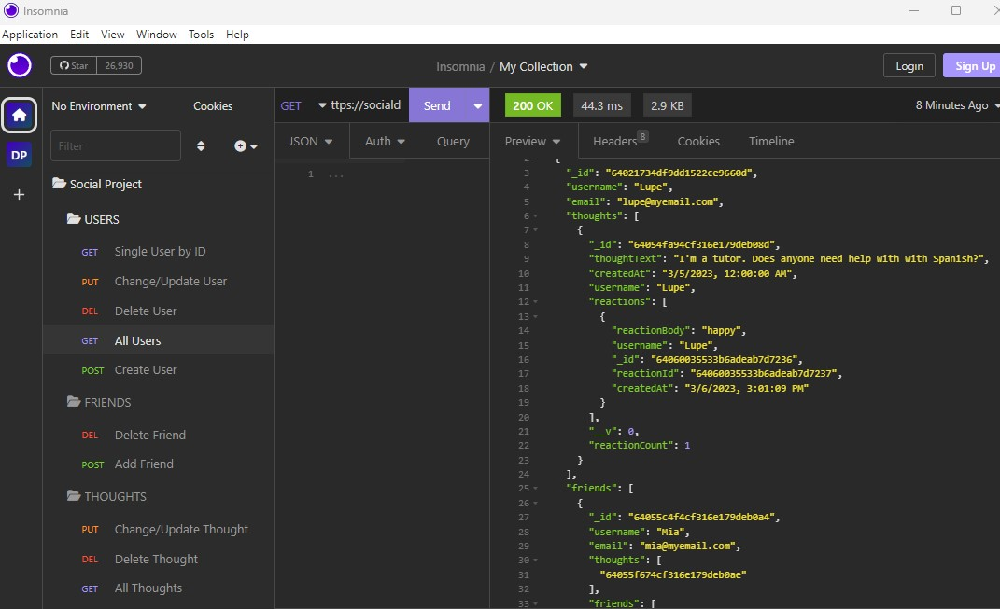

# Social_Network_API

## Description
The Social Network API is a social network web application where users can share their thoughts, react to friends’ thoughts, and create a friend list. This application was created using Express.js for routing, MongoDB database, and Mongoose ODM.

## Table of Contents

- [Installation](#installation)
- [Usage](#usage)
- [License](#license)
- [Contributing](#contributing)

## Installation
To install my project use the following link: https://github.com/dianavw8/Social_Network_API and follow these simple directions:

Above the list of files, click on the "Code" button.

Copy the URL for the repository.

Open Git Bash.

Change the current working directory to the location where you want the cloned directory.

Type git clone, and then paste the URL you copied earlier.

Press Enter to create your local clone.

For more help and information achiving this, check out the following website: https://docs.github.com/en/repositories/creating-and-managing-repositories/cloning-a-repository

## Usage
The walkthrough videos can be accessed using the following links: 

Get routes for all users & thoughts, single user & single thought
https://drive.google.com/file/d/1_XEwLSB5bMaug-lTg3swNl194yBEh82s/view

Post, Put & Delete routes for Users & Thoughts
https://drive.google.com/file/d/17n0EENx5bnjs_c8t4ZkXSFvZ6grtwyp7/view

Post & Delete routes for user friend and reactions
https://drive.google.com/file/d/19tOhMIIf-V2mehFMgI9vHTJtaz5P2OfQ/view

BONUS deletes a user's associated thoughts when the user is deleted
https://drive.google.com/file/d/11Q68bpPnrbnhI5qIHl8SXAdOxH9tVefU/view

The following image demonstrates the application's appearance and functionality:

## License

MIT License link: https://github.com/babel/babel/blob/master/LICENSE

## Contributing

The following are contributers to the making of the Social Network API:

https://shields.io/

https://choosealicense.com/
